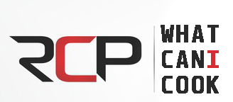
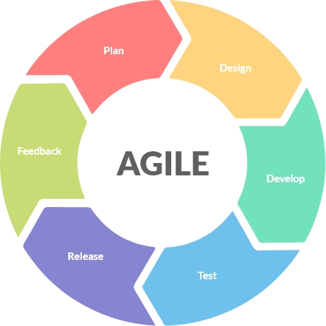
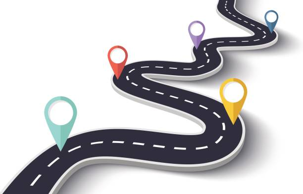

# Contents

- [Contents](#contents)
  - [What can I cook?](#what-can-i-cook)
  - [Tech](#tech)
  - [Project aspect and roles](#project-aspect-and-roles)
  - [Agile planning](#agile-planning)
    - [Must be](#must-be)
    - [Should be](#should-be)
    - [Could be](#could-be)
  - [The RoadMap](#the-roadmap)
  - [Design source](#design-source)
  - [Naming agreed roles](#naming-agreed-roles)

## What can I cook?

A unique recipe site that solves a basic problem in our lives.

Where you can choose the ingredients you have available at home and it will find the best matching recipes

You can also exclude some ingredients that you do not like or have food allergies to.

## Tech

We have used the following technology in building the application:

1. Html
2. CSS
3. [React](https://ionicframework.com/)
4. [Ionicframework](https://ionicframework.com) or [PrimeReact](https://primereact.org)
5. [Figma](https://www.figma.com/)

## Project aspect and roles

You can find all the project aspect and the main roles for each.

- Management [John](https://github.com/johnedelbi)
- Documentation (All of us)
- Design [Valeriya](https://github.com/V-Valkiriya) | [Renjani](https://github.com/renjani2022)
- Data [Valeriya](https://github.com/V-Valkiriya) | [Renjani](https://github.com/renjani2022)
- Code [John](https://github.com/johnedelbi) | [Bibha](https://github.com/bibhasingh) | [Brian](https://github.com/BrianMunene96)
- Unit testing (All of us)
- Presentation [Brian](https://github.com/BrianMunene96)

## Agile planning

### Must be

- API for recipes
- Filters (ingredients, kitchen type, time needed, type (allergies, vegan, low-calorie and other))
- Faceted search (?)
  
### Should be

- Random recipes
- User account
- Multiple ingredients filter

### Could be

- Rating
- Comments
- Favorite recipes
- Adding user’s recipes

## The RoadMap

After brainstorming with the team, we decided to divide the project into several versions to ensure workflow and timely delivery of the project

- Week 1 (Research)
  - Documentation
  - Prototype design (includes mobile version)
  - Find API
  - Read more about Facet, Vanilla CSS, Algolia
  - Choose a backend platform
- Week 2 (v1)
  - Figma design (homePage - filter - single recipe)
  - HTML/CSS
  - React code
- Week 3 (v2)
  - Figma design (User account, sign-in/sign-up)
  - HTML/CSS
  - React code
  - Database structure

In the coming weeks the rest will be added.

## Design source

You can check the figma source [here](https://www.figma.com/file/)

Here is some screenshots from the design

## Naming agreed roles

- CSS naming: lower-case with dashes
- React naming: camel case
- Branch naming: 00-name-v0
