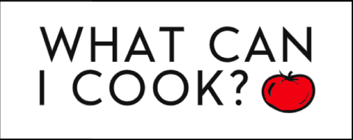
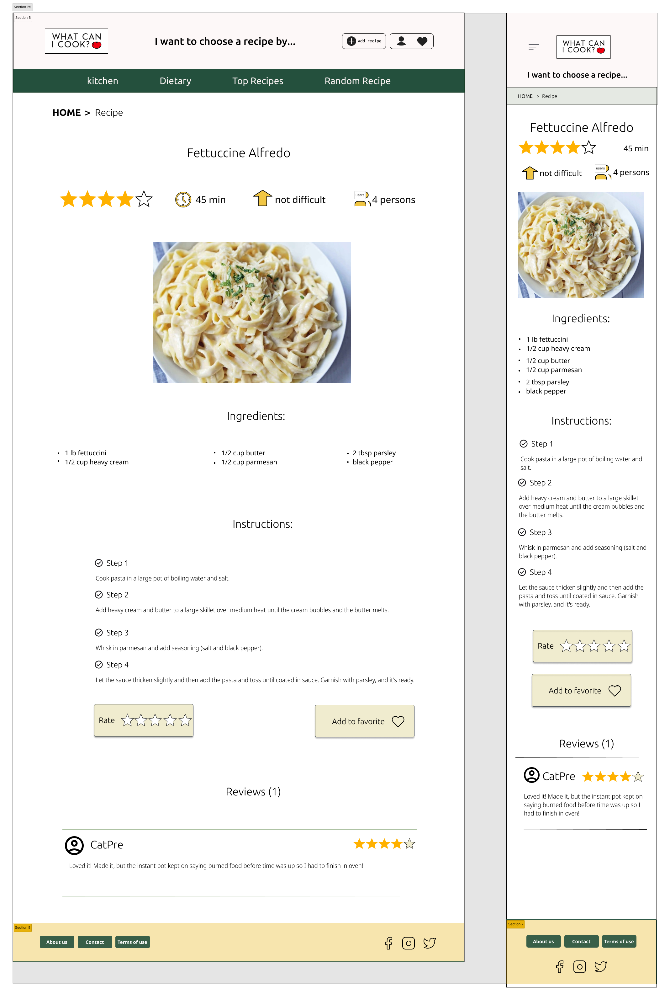

# Contents

- [Contents](#contents)
  - [What can I cook?](#what-can-i-cook)
  - [Project aspect and roles](#project-aspect-and-roles)
  - [The RoadMap](#the-roadmap)
  - [Screenshots](#screenshots)
  - [npm Library used](#npm-library-used)

## What can I cook?

A unique recipe site that solves a basic problem in our lives.

Where you can choose the ingredients you have available at home and it will find the best matching recipes

You can also exclude some ingredients that you do not like or have food allergies to.

## Project aspect and roles

Each of the team participates in all the tasks of the project. But based on the strengths of each participant, we assigned the roles. You can find all the project aspect and the main roles for each.

- project manager [John](https://github.com/johnedelbi)
- Documentation (All of us)
- Ux/Ui [Valeriya](https://github.com/V-Valkiriya) | [Renjani](https://github.com/renjani2022)
- Code [John](https://github.com/johnedelbi) | [Bibha](https://github.com/bibhasingh) | [Brian](https://github.com/BrianMunene96)
- Unit testing (All of us)
- Presentation [John](https://github.com/johnedelbi)

## The RoadMap

After brainstorming with the team, we decided to divide the project into several versions to ensure workflow and timely delivery of the project

- Week 1 (Research)
  - Documentation
  - Prototype design (includes mobile version)
  - Find API
  - Read more about Facet, Vanilla CSS, Algolia
  - Choose a backend platform
- Week 2 (v1)
  - Figma design (homePage - filter - single recipe)
  - HTML/CSS
  - React code
- Week 3 (v2)
  - Figma design (User account, sign-in/sign-up)
  - HTML/CSS
  - React code
  - Database structure
- week 4 (v2)
  - implement user join/login using email password
  - use firebase services (Auth & FireStore)
  - implement single recipe functionality
  
- week 5 (v3)
  - implement add to favorite
  - implement recipe rating
  - implement reset password

In the coming weeks the rest will be added.

## Screenshots

## npm Library used

- `npm install`
- `npm install primereact primeicons`
- `npm i uuid`
- `npm i primeflex`
- `npm install firebase`
- `npm i axios`
