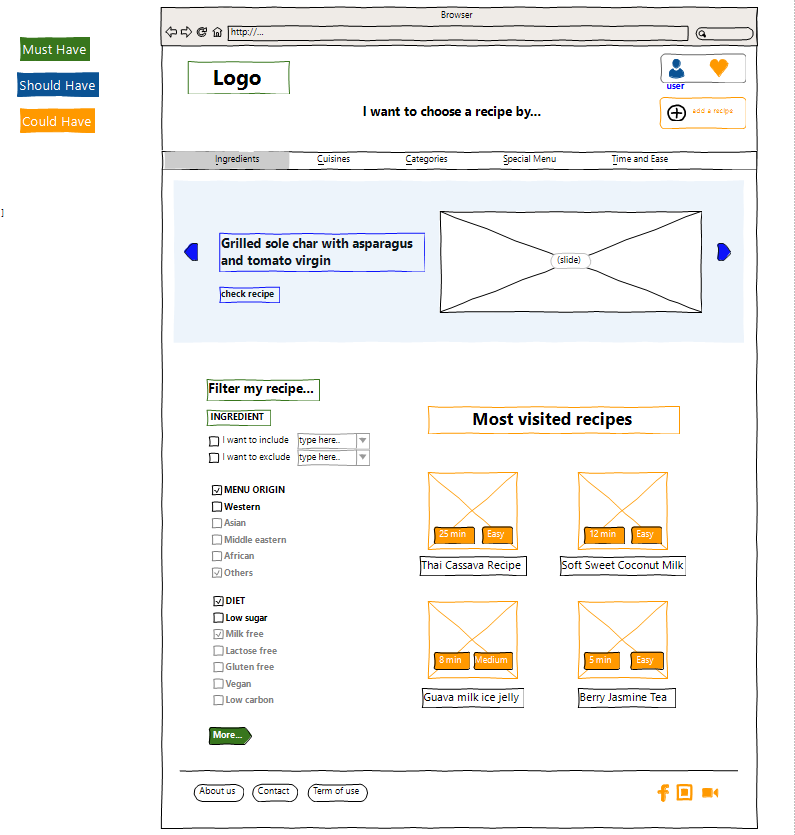
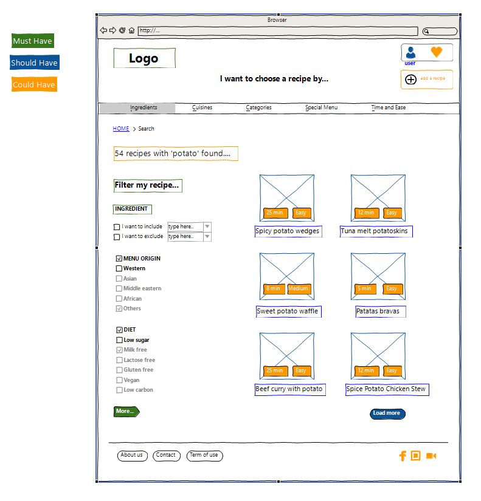

# the prototype of the What can I cook Website

---
we decided to do 2 prototypes and then we mixed them together to have the final one

the first prototype built using ["Excalidrow" platform](https://excalidraw.com/)
the second one built using ["wireframesketcher" platform](https://wireframesketcher.com/)

Here is the final prototype

## Homepage

## filters

## single recipe

## user account

