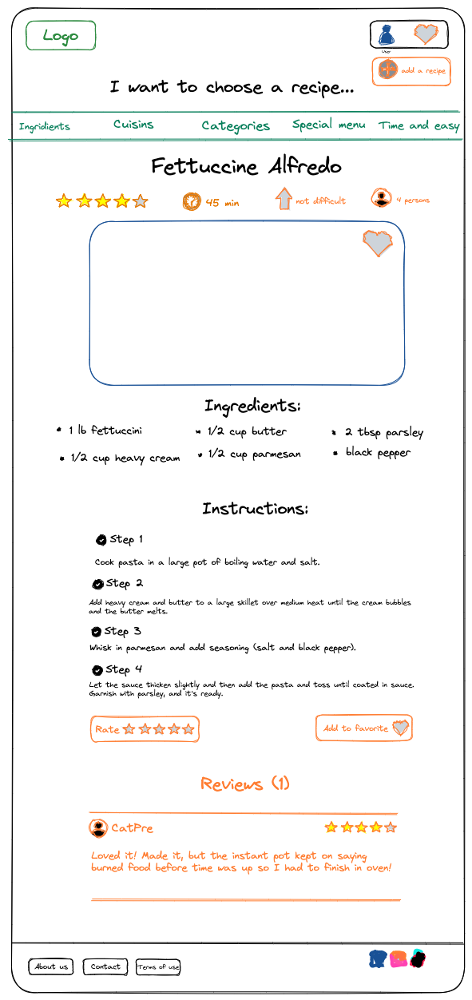
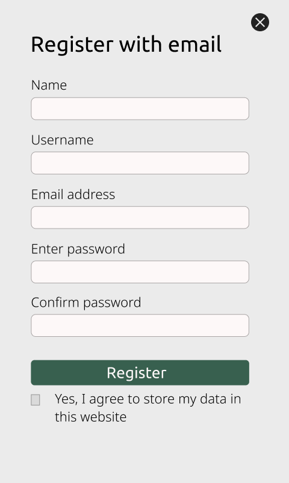

# Design of the What can I cook Website

---
You can check the figma source [here](https://www.figma.com/file/)

Here is all the design

## Homepage

## Filter-page

## single recipe

## Contact Us

## User Account

## Add Recipe

