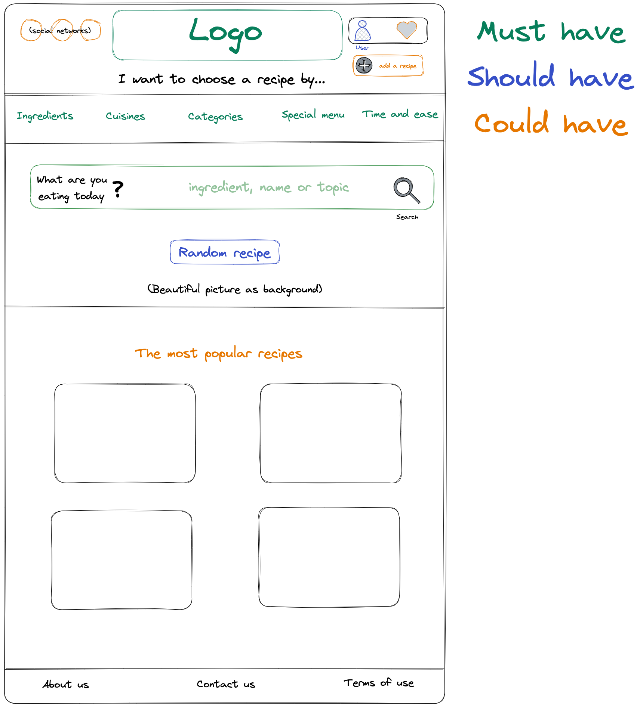
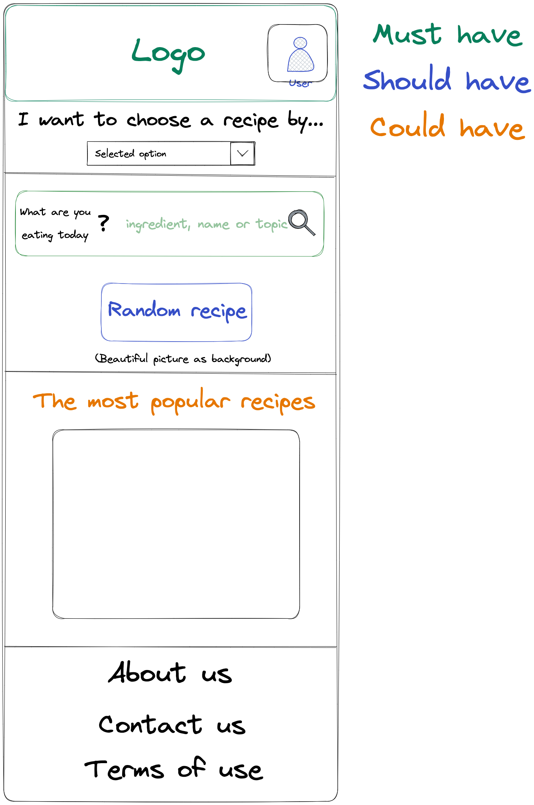

# The first version of prototype "What can I cook project?"

The website contains a home page, a page of the selected category, a search page and a recipe page.

## Homepage prototype desktop

## Homepage prototype mobile

## Recipe page prototype desktop

## Recipe page prototype mobile

### To create a prototype, we use ["Excalidrow" platform](https://excalidraw.com/)
