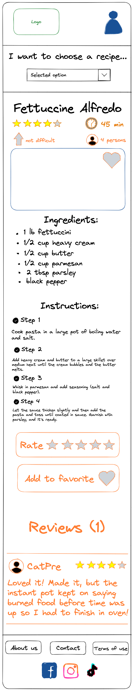

## The first version of prototype "What can I cook project?"

The website contains a home page, a page of the selected category, a search page and a recipe page.

 

#### Homepage prototype desktop:

 

#### Homepage prototype mobile:

#### Recipe page prototype desktop:

#### Recipe page prototype desktop:

###### To create a prototype, we use ["Excalidrow" platform](https://excalidraw.com/)
